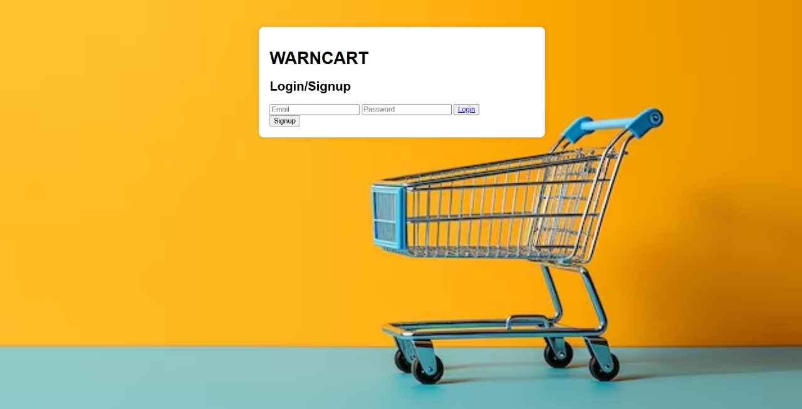

# [WARNCART] 🎯

## Basic Details
### Team Name: [ALCHEMIST]

### Team Members
- Member 1: [Name] - [College]
- Member 2: [Name] - [College]
- Member 3: [Name] - [College]

### Hosted Project Link
[https://mariyajoseph835.github.io/Alchemist/]

### Project Description
[The Product and Expiry Reminder web application helps users manage their inventory by allowing them to set reminders for product quantities and expiry dates. It notifies users 2 days before products run low or items are about to expire, making it ideal for personal or small business use.]

### The Problem statement
[The app solves the tedious problem of manually tracking product inventory and expiry dates by providing automated reminders. It ensures users are notified in advance to avoid running out of stock or using expired items, saving time and reducing waste.]

### The Solution
[This problem is solved by allowing users to input product details, such as quantity, reminder days, and expiry dates, into the app. The system then automatically sends notifications 2 days before products run low or reach their expiry date, helping users stay organized, avoid expired items, and maintain inventory without manual tracking.]

## Technical Details
### Technologies/Components Used
For Software:
- [Languages used]
- [Frameworks used]
- [Libraries used]
- [Tools used]

For Hardware:
- [List main components]
- [List specifications]
- [List tools required]

### Implementation
For Software:
# Installation
[commands]

# Run
[commands]

### Project Documentation
For Software:

# Screenshots (Add at least 3)

*Add caption explaining what this shows*

*Add caption explaining what this shows*

*Add caption explaining what this shows*

# Diagrams

*Add caption explaining your workflow*

For Hardware:

# Schematic & Circuit

*Add caption explaining connections*

*Add caption explaining the schematic*

# Build Photos

*List out all components shown*

*Explain the build steps*

*Explain the final build*

### Project Demo
# Video
[Add your demo video link here]
*Explain what the video demonstrates*

# Additional Demos
[Add any extra demo materials/links]

## Team Contributions
- [Name 1]: [Specific contributions]
- [Name 2]: [Specific contributions]
- [Name 3]: [Specific contributions]

---
Made with ❤️ at TinkerHub
